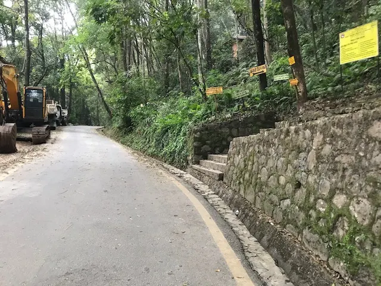
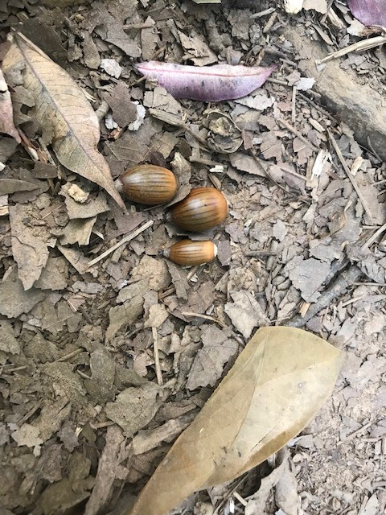
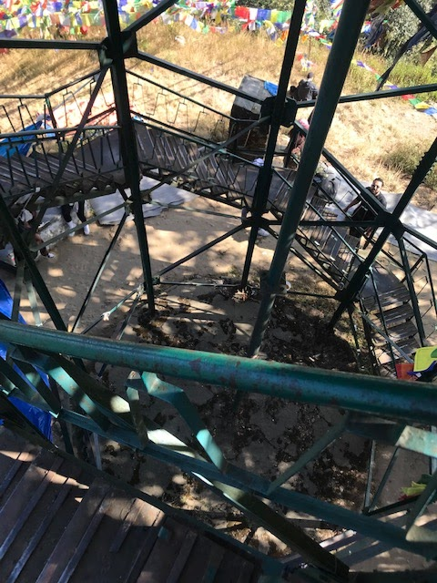

Jamacho peak, the top of the Nagarjun hill (a segment of Shivapuri-Nagarjun National Park) has remained a significant religious site for Hindus and Buddhists of Kathmandu valley. The peak has now become an attractive spot for hikers.
  
  
Hiking up to Jamacho peak and down is around 5 hours trip. All you need is to have the readiness to wake up early in the morning with a few essentials and reach Fulbari Gate, the entrance to the Jamajho Gumba.

One fine morning, I accompanied my nephew for my first Jamacho experience. In his case, it was his 5th ascend to the top of the hill.

**How to go to Jamacho hike?**

In our case, we met together at Machhapokhari Chowk (bus stop about 200m West from the new buspark). From there, we walked along a road leading northwest up to Fulbari Gate which is located at the base of the Nagarjun hill.

**Requirements**

In our case, we bought some snacks and sweets at Macchapokhari. I had brought water from home, so we did not need to buy water in the bottle. You may need some snacks to eat. Water is essential.

Best clothing may include a pair of hiking shoes, inners, trousers, a middle layer for the upper body, and an outer layer (wind/waterproof). A walking stick helps in maintaining the balance of the body during hiking.

If you think that Nepali sweets (like _Jeri_) are a bit more inappropriate, some lozenges of orange ball candy can be an alternative for quick energy.

**Shivapuri Nagarjun National Park (NP) Regulations for Hikers**

Arrive early, because NP authorities and security personnel suggest you leave the NP area by 5 pm. The entrance fees are different for various groups: students, Nepali nationals, SAARC countries nationals, and foreign nationals.

Your presence along with names will be registered at various points- mostly at the entrance of the hiking trail, and at the midpoint of the same trail. Please do not forget your valid ID. Otherwise, your attempt to ascend up to the Jamacho Gumba may go in vain.

**Jamacho Trail**

Actually, the motorable road can lead one up to the Nagarjun Peak. However, there is an allotted trail for hiking. One must adhere to the trail. Otherwise, s/he may risk the biodiversity, and/or expose to the dangers of the wilderness.

{}
On the day of Buddha Jayanti, the pilgrims make a spectacular caravan en route to Jamacho Peak.
{}

**The Top!**

Nagarjun Peak is a must-go place in Kathmandu if you are a hiker. From there, you can see the breathtaking span of the Himalayan range. You can also see Kathmandu Valley from above!

There is a viewtower for the purpose.

As a must-do hiking routine, we clicked pictures of our fulfilled (and fun-filled) faces while enjoying the 'view'.

 peak")