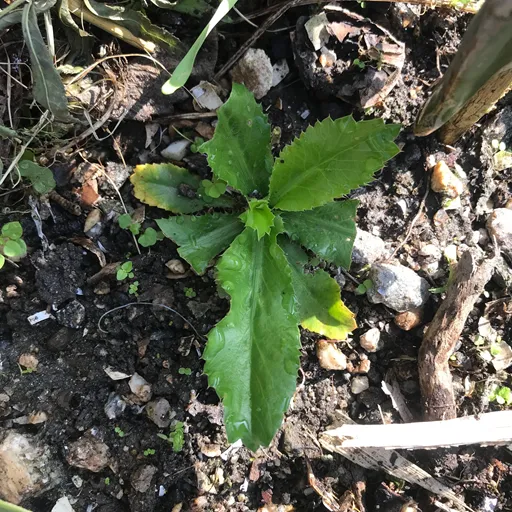
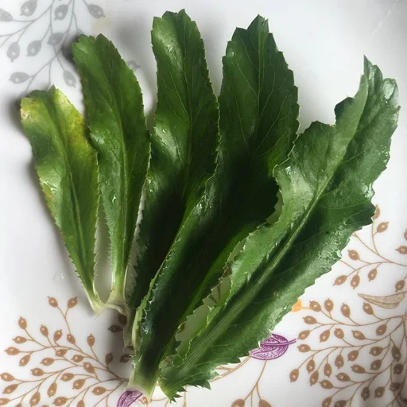

Nepali Kade Dhaniya (Kaade Dhaniya, Ban Dhaniya, Burmeli Dhaniya) is not Nepali by origin. It is said to have spread throughout the world from the Americas and the Caribbean.

One of my neighbors gifted me with a new kind of herb with a pleasant aroma in 2019. The smell was similar to that of cilantro (coriander). I planted it on the poly bag of my rooftop garden. Rest is history; I now have almost become an activist in spreading culantro throughout my circle of the organic movement.

Initially, I did not intentionally expand the plant by vegetative propagation or by seeds. I did not observe any significant root system development so that I could perform a vegetative propagation. Yet, I found its young sprouts here and there in my garden. I have been giving off those sprouts to my acquaintances. I am close to the conclusion (after reading educational resources) that this random propagation has been because of the natural spreading of small seeds that formed on the mature plants.

It was only during the summer of 2024, that I sowed the proper seeds of culantro, got saplings grown, and distributed amongst my colleagues, neighbours, and relatives.

")

Since it pops out as a wild herb here and there, I realized why some people in Nepal call it _Ban Dhaniya_ which means 'wild cilantro'.

Like a normal salad of coriander and smashed tomato, I experimented replacing the coriander with this culantro. Putting it simple, I ground together tomatoes, a little salt, turmeric powder, 2 grains of Sichuan pepper, small bit of red chili, and leaves of cilantro.

If you are a Nepali and unaware of this herb, you might be interested in trying out _Golbheda ra Kade Dhaniya ko Achar_ (salad of tomatoes and culantro).

I have determined to continue raising, caring for, and propagating this wonder herb. Nepali Kade Dhaniya rocks!