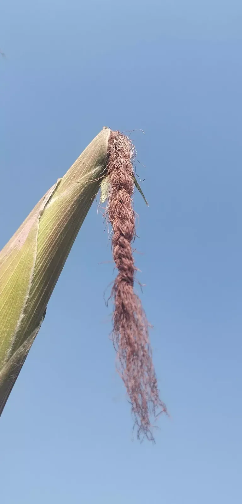

Nature activities help kids to connect with nature. They will embrace all the tangibles and intangibles that nature can offer to them. While they do nature activities they spend quality time with people around them which helps in their well-being - physically, mentally, socially, and emotionally.

In this article, I am listing the nature activities that I do with my own kids. Hence, I will be updating this article time and again.



1\. Foraging the edibles
------------------------

Got a lawn where wild and edible herbs grow? Collecting such herbs for eating projects can be fun and a good learning oportunity. As humankind has been struggling with climate change and global food crisis, this activity adds to the resilience of the young citizens.

Berry-collection and mushroom foraging are other examples.

I collect pods of common vetch with my kids when it is a sunny afternoon during the winter. Our family also collects Lambs Quarters to consume as curry. Another wild herb that we try is Oxalis latifolia_ Kunth (chari amili/amilo) which grows wildly in our backyard during the fall season.

2\. Supervised free-play
------------------------

If you have time and commitment to look after free-playing kids, this is another important thing to do in the nature. Sometimes do not like to be directed or guided. They want to do some free-play. This helps in enhancing their their social skills (role-play and negotiation skills), and other abstract skills (imagination). They will also become risk-takers, and experimentors during the free-play.

3\. Nature-based artwork
------------------------

Kids can spend hours making artwork from the physical elements found in the nature. They can make many kinds of things using twigs, stones, and even the petals fo the flowers as part of their decorative artwork project. What about painting the rock?

Such art-work based on natural elements helps kids to develop a bond with nature.

I believe that this helps in enriching their imagination skills, and emotional skills (affection and appreciation).

4\. Growing the plants from the seeds
-------------------------------------

I have worked together with my kids in growing varius types fo plants. The plants range from tree to herbs. This helps in cognitive enrichment of the little kids. They learn many things while they grow plants from the seeds. For example, they learn abnout the criteria of the suitable seed, optimal condition for seed growing, best season for the seed growing, and so on. This will also increase their locus of control as they begin to witness the outcome of the work they have done.

5\. Physical Activity
---------------------

There are various outdoor physical activities that one does for one's own fitness. These activities also establish a bond with nature.

Hiking helps kids in shaping their physical capacity to explore the nature. They will appreciate the nature, and the company of people for nature-based activity. Outdoor gym is also another such opportunity.

What about supervised swimming with the safety backup? This helps in exploring the nature in vertical dimension. Another element of nature (bulk of water) is added to one's nature experience. Swimming also helps in preparing one to add to nuances of skills in living with nature.

6\. Home gardening
------------------

Got a home-garden? Your kids will enjoy doing things with you. You may have dead parts of the plants that need to be pruned. You may also need to mix soil with the vermicompost that you have just brought in. What about watering the growing herbs? Composting the kitchen waste in the premises of home-garden can also be part of the process. Home-gardening with kids gives them a greater locus of control and helps in enrichment of gardening skills.

<iframe allow="accelerometer; autoplay; clipboard-write; encrypted-media; gyroscope; picture-in-picture; web-share" allowfullscreen="" frameborder="0" height="315" loading="lazy" referrerpolicy="strict-origin-when-cross-origin" src="https://www.youtube.com/embed/hFtGfIDlew4?si=V_u-M6iwoU1MdPgz" title="YouTube video player" width="560"></iframe>

They will understand the wide empire of plant-and animal life in the garden. Not just the names of the flora and fauna, they will also understand the life processes of the same. Doing things in the home garden, they also find a purpose of engaging in life. At least, they hate remaining idle and doing nothing.

7\. Litter Collection
---------------------

Your backyard may not offer big area for litter collection. You may involve your kids to do volunteering in cleaning your neighbourhood. Doing so, they connect well with nature and feel a sense of responsibility towards nature and society in general. They also realize their agency in nature restoration.