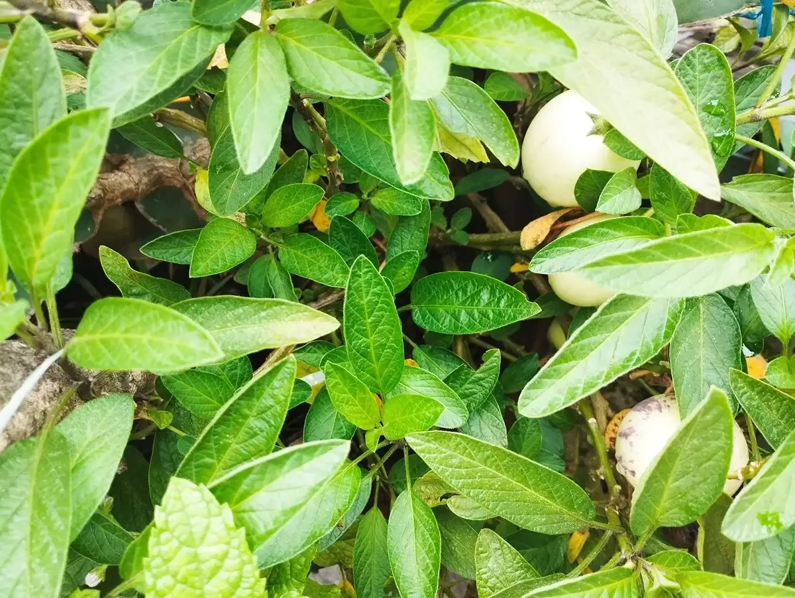

From South America, perhaps not straight to Nepal; this wonder herb has failed to win my heart (I am saying this with 50 percent honesty with the words I choose, yet I stick with my choice). I am sorry Pepino; you do not taste sweet, sour, or anything good.

However, Pepino melon has added itself to the list of my organic gardening. A small twig of it was gifted to me by one of my old friends who also runs a nursery. Then, I was unaware of the sheer volume of the bush it grows into, and the amount of fruit it yields in a season.

It almost died last year when we did not take care of its bush. Around the same time of its potential death, I accidentally watched a video on social media where a rooftop farmer in Kathmandu was seen mentioning the pros of eating the fruit it yields. He said that pepino melon has a beneficial role in the health of an individual in various ways.

I then transplanted a few twigs of the almost-dying plant into a new place. Magic followed; each twig grew into glossy and juicy bush as I watered the new plantation daily and prevented water logging at the same time.

I am still not sure whether it is valuable to write a blog post for this fruit with no taste. However, one can have something as a fruit to eat when s/he plants this herb on the garden, kitchen garden, growing pot, or what else?

**Pepino Melon in Nepali**  
Few Nepali speaking agro scientists call it Pepino Tarbuja (पेपिनो तर्बुजा); while rest simply call it pepino melon.